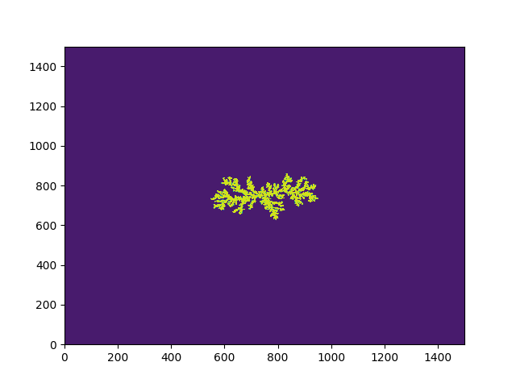

## This is the repository with my final project for the PHYS3142 Computational Methods course. 

**Project Aim: Do a monte-carlo simulation for the Diffusion crystal aggregation.**

I have reproduced the experiment proposed by Witten and Sander [paper](https://journals.aps.org/prl/pdf/10.1103/PhysRevLett.47.1400). The results of the experiment agree with those of origingal paper. The work was fully performed on Python. 

Picture of the fractal structure:

_Project was done by: Raiymbek Kerimbek_
